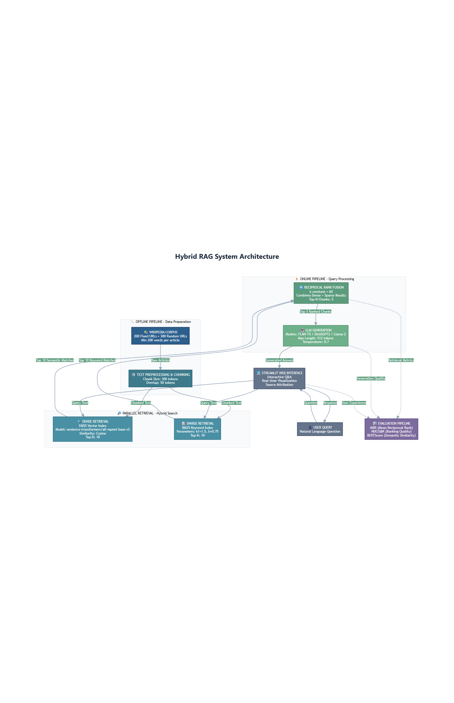

# Hybrid RAG System with Automated Evaluation

A comprehensive Retrieval-Augmented Generation (RAG) system combining dense vector retrieval, sparse keyword retrieval (BM25), and Reciprocal Rank Fusion (RRF) to answer questions from Wikipedia articles.

## 📋 Table of Contents

- [Overview](#overview)
- [Features](#features)
- [System Architecture](#system-architecture)
- [Installation](#installation)
- [Quick Start](#quick-start)
- [Usage](#usage)
- [Evaluation Metrics](#evaluation-metrics)
- [Project Structure](#project-structure)
- [Configuration](#configuration)
- [Results](#results)
- [Contributing](#contributing)

## 🎯 Overview

This project implements a state-of-the-art hybrid RAG system that:

1. **Collects and processes** 500 Wikipedia articles (200 fixed + 300 random)
2. **Retrieves information** using both dense (semantic) and sparse (keyword) methods
3. **Combines results** using Reciprocal Rank Fusion (RRF)
4. **Generates answers** using transformer-based language models
5. **Evaluates performance** with comprehensive metrics and ablation studies

## ✨ Features

### Part 1: Hybrid RAG System

- **Dense Vector Retrieval**: Semantic search using sentence transformers and FAISS
- **Sparse Keyword Retrieval**: BM25 algorithm for keyword matching
- **Reciprocal Rank Fusion**: Intelligent combination of retrieval methods
- **LLM Generation**: Answer generation using FLAN-T5, DistilGPT2, or Llama-2
- **Interactive UI**: Streamlit-based web interface

### Part 2: Automated Evaluation

- **Question Generation**: Automated creation of 100 diverse Q&A pairs
- **Comprehensive Metrics**:
  - **Mandatory**: Mean Reciprocal Rank (MRR) at URL level
  - **Custom 1**: NDCG@K for ranking quality
  - **Custom 2**: BERTScore for semantic similarity
- **Innovative Features**:
  - Ablation studies comparing dense, sparse, and hybrid methods
  - Error analysis by question type
  - Response time analysis
  - Detailed visualizations

## 🏗️ System Architecture

```
┌─────────────────────────────────────────────────────────────┐
│                     Wikipedia Corpus                         │
│              (200 Fixed + 300 Random URLs)                   │
└─────────────────────┬───────────────────────────────────────┘
                      │
                      ▼
┌─────────────────────────────────────────────────────────────┐
│              Text Preprocessing & Chunking                   │
│         (200-400 tokens with 50-token overlap)               │
└─────────────┬───────────────────────┬───────────────────────┘
              │                       │
              ▼                       ▼
    ┌─────────────────┐    ┌──────────────────┐
    │  Dense Retrieval │    │ Sparse Retrieval │
    │   (FAISS Index)  │    │   (BM25 Index)   │
    └────────┬─────────┘    └────────┬─────────┘
             │                       │
             └───────────┬───────────┘
                         ▼
              ┌──────────────────────┐
              │ Reciprocal Rank      │
              │ Fusion (RRF)         │
              └──────────┬───────────┘
                         ▼
              ┌──────────────────────┐
              │   LLM Generation     │
              │   (FLAN-T5/GPT)      │
              └──────────┬───────────┘
                         ▼
              ┌──────────────────────┐
              │   Generated Answer   │
              └──────────────────────┘
```


## 🚀 Installation

### Prerequisites

- Python 3.8 or higher
- 8GB+ RAM recommended
- GPU optional (for faster processing)

### Step 1: Clone Repository

```bash
cd ~/Hybrid_RAG_System
```

### Step 2: Create Virtual Environment

```bash
python -m venv venv
source venv/bin/activate  # On Windows: venv\Scripts\activate
```

### Step 3: Install Dependencies

```bash
pip install -r requirements.txt
```

### Step 4: Download NLTK Data

```python
python -c "import nltk; nltk.download('punkt'); nltk.download('stopwords')"
```

## 🎬 Quick Start

### Build the Complete System

Run the entire pipeline with a single command:

```bash
# 1. Install dependencies
pip install -r requirements.txt
python -m spacy download en_core_web_sm
python -c "import nltk; nltk.download('punkt'); nltk.download('stopwords')"

# 2. Run the complete system
# Use existing data (if available)
python RUN_COMPLETE_SYSTEM.py

# Force fresh rebuild (runs full pipeline end-to-end)
python RUN_COMPLETE_SYSTEM.py --force-rebuild

# Regenerate PDF report only (fast; uses existing outputs/evaluation_results.json)
python RUN_COMPLETE_SYSTEM.py --report-only

# Get help
python RUN_COMPLETE_SYSTEM.py --help
```

This will:
1. Collect 500 Wikipedia articles
2. Preprocess and chunk the text
3. Build dense and sparse indices
4. Generate 100 evaluation questions
5. Run complete evaluation with metrics
6. Generate visualizations and reports

**Estimated time**: 2-4 hours (depending on hardware)


### Full Rebuild Mode

Use this when you need fresh random URLs and a full end-to-end rerun:

```bash
python RUN_COMPLETE_SYSTEM.py --force-rebuild
```

### Launch Web Interface
To use the main RAG Q&A system:
```bash
streamlit run src/streamlit_app.py
```

### Launch Evaluation Dashboard
To view interactive charts and metrics:
```bash
streamlit run src/evaluation_dashboard.py
```

Then open `http://localhost:8501` (or the URL shown in terminal) in your browser.

## 📖 Usage

### Using the Streamlit Interface

1. **Start the app**: `streamlit run src/streamlit_app.py`
2. **Enter a question** in the text box or select an example
3. **Click "Search and Answer"**
4. **View results**:
   - Generated answer
   - Retrieved chunks with sources
   - Dense and sparse retrieval details
   - Response time and metrics

### Using the Python API

```python
from src.dense_retrieval import DenseRetriever
from src.sparse_retrieval import BM25Retriever
from src.rrf_fusion import HybridRetriever
from src.llm_generation import LLMGenerator, RAGPipeline

# Load retrievers
dense_retriever = DenseRetriever()
dense_retriever.load_index("data/vector_index")

sparse_retriever = BM25Retriever()
sparse_retriever.load_index("data/bm25_index.pkl")

# Create hybrid retriever
hybrid_retriever = HybridRetriever(dense_retriever, sparse_retriever)

# Create LLM generator
generator = LLMGenerator(model_name="google/flan-t5-base")

# Create RAG pipeline
rag = RAGPipeline(hybrid_retriever, generator)

# Query
result = rag.query("What is machine learning?")
print(result['answer'])
```

### Running Evaluation

```python
from src.evaluation_pipeline import EvaluationPipeline

eval_pipeline = EvaluationPipeline(rag_pipeline, dense_retriever, sparse_retriever)

results = eval_pipeline.run_full_evaluation(
    questions_file="data/questions.json",
    output_dir="outputs",
    top_k=10,
    top_n=5
)
```

## 📊 Evaluation Metrics

### Mandatory Metric: MRR (Mean Reciprocal Rank)

**Purpose**: Measures how quickly the system finds the correct Wikipedia URL.

**Calculation**:
```
MRR = (1/N) × Σ(1/rank_i)
```
where rank_i is the position of the first correct URL for question i.

**Interpretation**:
- MRR = 1.0: Perfect (correct URL always ranked first)
- MRR = 0.5: Correct URL appears on average at position 2
- MRR = 0.0: No correct URLs found

### Custom Metric 1: NDCG@K

**Justification**: NDCG evaluates ranking quality by considering both relevance and position. It penalizes relevant documents appearing lower in rankings, making it ideal for retrieval systems where rank order matters.

**Calculation**:
```
DCG@k = Σ(i=1 to k) [rel_i / log2(i + 1)]
NDCG@k = DCG@k / IDCG@k
```

**Interpretation**:
- NDCG > 0.8: Excellent ranking quality
- NDCG 0.6-0.8: Good ranking
- NDCG 0.4-0.6: Moderate ranking
- NDCG < 0.4: Poor ranking

### Custom Metric 2: BERTScore

**Justification**: BERTScore captures semantic similarity beyond lexical overlap using contextual embeddings. It's robust to paraphrasing and better reflects answer quality than traditional metrics like BLEU or ROUGE.

**Calculation**:
- Compute cosine similarity of BERT embeddings for each token pair
- Precision: Average max similarity for candidate tokens
- Recall: Average max similarity for reference tokens
- F1: Harmonic mean of precision and recall

**Interpretation**:
- F1 > 0.9: Excellent semantic similarity
- F1 0.8-0.9: Good similarity
- F1 0.7-0.8: Moderate similarity
- F1 < 0.7: Poor similarity

## 📁 Project Structure

```
Hybrid_RAG_System/
├── README.md                      # This file
├── requirements.txt               # Python dependencies
├── config.yaml                    # Configuration file
├── build_system.py               # Main build script
│
├── src/                          # Source code
│   ├── data_collection.py        # Wikipedia data collection
│   ├── preprocessing.py          # Text preprocessing & chunking
│   ├── dense_retrieval.py        # Dense vector retrieval (FAISS)
│   ├── sparse_retrieval.py       # Sparse retrieval (BM25)
│   ├── rrf_fusion.py             # Reciprocal Rank Fusion
│   ├── llm_generation.py         # LLM answer generation
│   ├── question_generation.py    # Question generation
│   ├── evaluation_metrics.py     # Evaluation metrics
│   ├── evaluation_pipeline.py    # Evaluation pipeline
│   └── streamlit_app.py          # Web interface
│
├── data/                         # Data directory
│   ├── fixed_urls.json          # 200 fixed Wikipedia URLs
│   ├── raw_corpus.json          # Raw Wikipedia articles
│   ├── processed_chunks.json    # Preprocessed chunks
│   ├── questions.json           # Evaluation questions
│   ├── vector_index/            # FAISS index
│   └── bm25_index.pkl          # BM25 index
│
├── outputs/                     # Evaluation outputs
│   ├── evaluation_results.json
│   ├── results_table.csv
│   ├── ablation_comparison.png
│   ├── response_time_distribution.png
│   └── error_analysis.png
│
├── logs/                        # Log files
└── models/                      # Downloaded models (auto-created)
```

## ⚙️ Configuration

Edit `config.yaml` to customize:

```yaml
# Dataset settings
dataset:
  fixed_urls_count: 200
  random_urls_count: 300
  min_article_words: 200

# Chunking settings
chunking:
  chunk_size: 300  # tokens
  overlap: 50      # tokens

# Dense retrieval
dense_retrieval:
  model_name: "sentence-transformers/all-mpnet-base-v2"
  top_k: 10

# Sparse retrieval
sparse_retrieval:
  k1: 1.5
  b: 0.75
  top_k: 10

# RRF
rrf:
  k_constant: 60
  top_n_chunks: 5

# LLM
llm:
  model_name: "google/flan-t5-base"
  max_length: 512
  temperature: 0.7
```

## 📈 Results

After running the evaluation, you'll find:

1. **evaluation_results.json**: Complete results in JSON format
2. **results_table.csv**: Per-question results table
3. **Visualizations**:
   - Ablation study comparison
   - Response time distribution
   - Error analysis by question type

### Example Results

```
=== EVALUATION SUMMARY ===
Number of Questions: 100
Average Response Time: 2.34s

--- Mandatory Metric ---
MRR (URL Level): 0.7850

--- Custom Metric 1: NDCG ---
NDCG@5: 0.8123

--- Custom Metric 2: BERTScore ---
BERTScore F1: 0.8567

--- Ablation Study ---
Dense Only:   MRR=0.7234, NDCG=0.7567
Sparse Only:  MRR=0.6891, NDCG=0.7234
Hybrid (RRF): MRR=0.7850, NDCG=0.8123
```

## 🔧 Advanced Usage

### Custom Question Generation

```python
from src.question_generation import QuestionGenerator

generator = QuestionGenerator()
questions = generator.generate_questions_from_chunks(
    chunks,
    num_questions=50,
    distribution={
        'factual': 0.4,
        'comparative': 0.3,
        'inferential': 0.3
    }
)
```

### Ablation Studies

```python
from src.evaluation_pipeline import EvaluationPipeline

eval_pipeline = EvaluationPipeline(rag_pipeline, dense_retriever, sparse_retriever)
ablation_results = eval_pipeline.ablation_study(questions, top_k=10)
```

### Error Analysis

```python
error_analysis = eval_pipeline.error_analysis(
    questions,
    retrieval_results,
    generated_answers
)
```

## 📝 Fixed Wikipedia URLs

The 200 fixed URLs are stored in `data/fixed_urls.json`. These URLs remain constant across all runs to ensure reproducibility.

**Note**: The fixed URLs will be automatically generated on first run if the file doesn't exist. Each group should ensure they have a unique set of 200 URLs.
